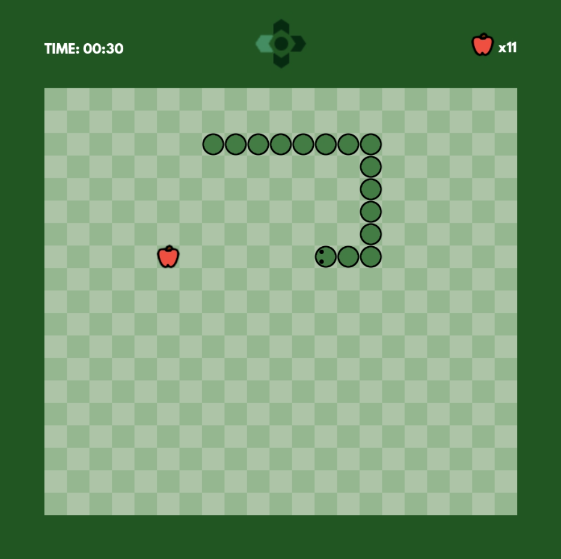

# Godot-Snake-Game
 A small example about creating a simple snake game in Godot Engine.
 It teaches you how to:
 - Create a player controller for real-time snake-like movement using tweens
 - Make the snake grow
 - Generate fruits in random positions, 
 - Add logic for when the fruit spawns inside the snake
 - Play some basic sounds
 - Setup simple UIs for your game
 - Use basic string formatting for strings such as time
 - Create a basic game over screen

 